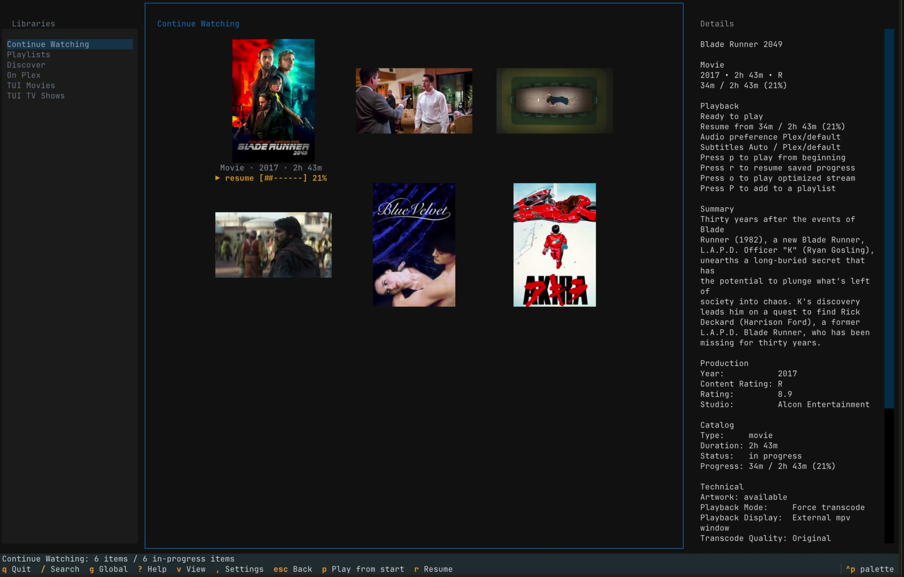
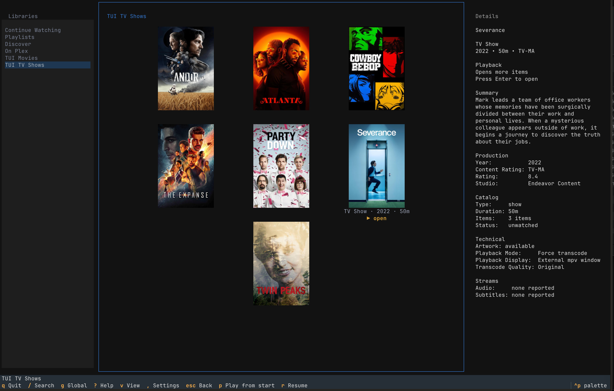

# plex-tui

<p align="center">
  
</p>

<p align="center">
  <a href="https://github.com/so1omon563/plex-tui/actions/workflows/ci.yml"></a>
  <a href="https://github.com/so1omon563/plex-tui/releases/latest"></a>
  <a href="https://pypi.org/project/plex-tui/"></a>
  <a href="https://aur.archlinux.org/packages/plex-tui"></a>
  <a href="https://github.com/so1omon563/homebrew-plex-tui"></a>
  <a href="LICENSE"></a>
</p>

plex-tui is a terminal Plex client for browsing and watching media.

It is built around a quiet three-pane interface: libraries on the left, artwork
and media selection in the center, and playback context on the right. The app is
keyboard-first, media-first, and designed for choosing something to watch
without leaving the terminal.

Plex, from the terminal.

[](https://plex-tui.so1omon.app)

[Watch the showcase](https://plex-tui.so1omon.app) or install from your package
channel:

```bash
brew trust --tap so1omon563/plex-tui
brew tap so1omon563/plex-tui
brew install plex-tui
plex-tui --smoke
```

## What It Feels Like

plex-tui is not a server administration tool and it is not a retro terminal
novelty. It treats the terminal as a modern application surface: structured,
calm, and direct.

Real media gets real artwork. Details unfold only when they help the decision.
The footer keeps common actions close, while the full keyboard reference stays
in Help.

## Screenshots

Three surfaces carry the shape of the app: the main movie grid, personalized
Continue Watching state, and first-class TV browsing.

### Movies: the primary browsing surface


Poster artwork carries the page. The selected item gains just enough metadata
and action context to make the next choice clear.

### Continue Watching: Plex state at the front


In-progress media opens from Plex playback state, with resume progress and
direct playback actions visible without changing modes.

### TV Shows: shows, seasons, and episodes



TV libraries use the same browsing rhythm as movies while keeping show context
clear as you move into seasons and episodes.

## What It Does

1. Browse Plex libraries through a focused terminal interface.
2. Navigate with explicit keyboard flows.
3. Launch playback through `mpv` while Plex remains the source.
4. Keep diagnostics near the running app.
5. Fit macOS and Linux terminal habits.

## Install

plex-tui requires Python 3.11 or newer, a Plex account/server, and `mpv` for
playback.

### Homebrew

```bash
brew trust --tap so1omon563/plex-tui
brew tap so1omon563/plex-tui
brew install plex-tui
plex-tui --smoke
```

The Homebrew formula installs `mpv` automatically.

### PyPI

```bash
pipx install plex-tui
plex-tui --smoke
plex-tui
```

This is the recommended cross-platform Python install path. Install `mpv`
separately with your platform package manager.

### Arch Linux

```bash
paru -S plex-tui
plex-tui --smoke
```

Any AUR helper can be used; `paru` is only an example.

### From GitHub

```bash
pipx install "git+https://github.com/so1omon563/plex-tui.git"
pipx install "git+https://github.com/so1omon563/plex-tui.git@v0.13.6"
```

Use this path when testing `main` or a tagged release before it reaches your
preferred package channel.

## First Run

Launch `plex-tui` and follow the Plex browser login. The app saves the selected
server connection and token in the platform config directory.

Useful checks:

```bash
plex-tui --version
plex-tui --smoke
plex-tui --diagnostics
plex-tui --config-path
```

Read the [User Guide](docs/user-guide.md) for configuration, playback,
keyboard shortcuts, artwork modes, diagnostics, and CLI helper commands.

## Current Surface

- Plex browser login, server selection, and Plex Home profile switching.
- Continue Watching, Playlists, Discover, On Plex, and normal library browsing.
- Movie, show, season, episode, collection, category, hub, and playlist views.
- Poster artwork in grid view, with Kitty/Ghostty native image support when
  available and block art elsewhere.
- Current-library search, global Plex search, and read-only CLI helpers.
- External `mpv` playback with play-from-start, resume, optimized transcode,
  progress reporting, watched state, and active pause/seek/stop controls.
- Audio and subtitle preference pickers with saved defaults.
- Settings for stream preferences, playback display, artwork, grid density,
  library visibility/order, optional sidebar entries, and diagnostics.

## Documentation

- [User Guide](docs/user-guide.md): configuration, playback, key bindings,
  artwork, diagnostics, and CLI helpers.
- [Documentation Index](docs/README.md): the full user-to-maintainer path.
- [Design](DESIGN.md): the product and visual principles behind the app.
- [Architecture](docs/architecture.md): runtime shape and source map.
- [Packaging](PACKAGING.md): PyPI, Homebrew, AUR, and packaging automation.
- [Release Checklist](RELEASE.md): release prep, validation, and publishing.
- [Roadmap](ROADMAP.md): planned follow-up work.
- [Contributing](CONTRIBUTING.md): local development and PR expectations.

## Development

```bash
git clone https://github.com/so1omon563/plex-tui.git
cd plex-tui
python3 -m venv .venv
source .venv/bin/activate
make install-dev
make check
```

Common commands are documented in [Contributing](CONTRIBUTING.md). Public
release and package maintenance lives in [Release Checklist](RELEASE.md) and
[Packaging](PACKAGING.md).
