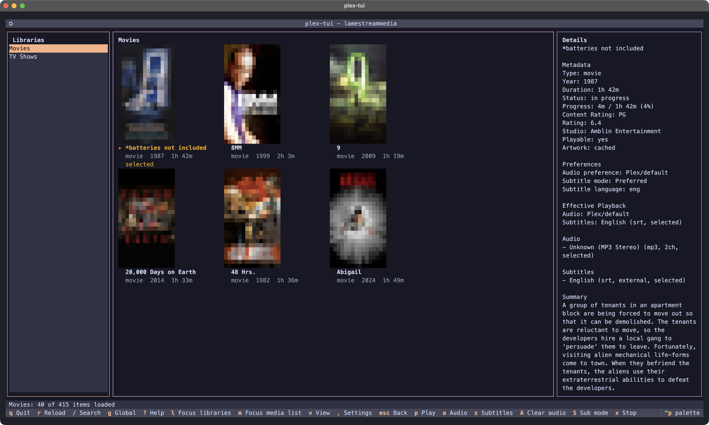
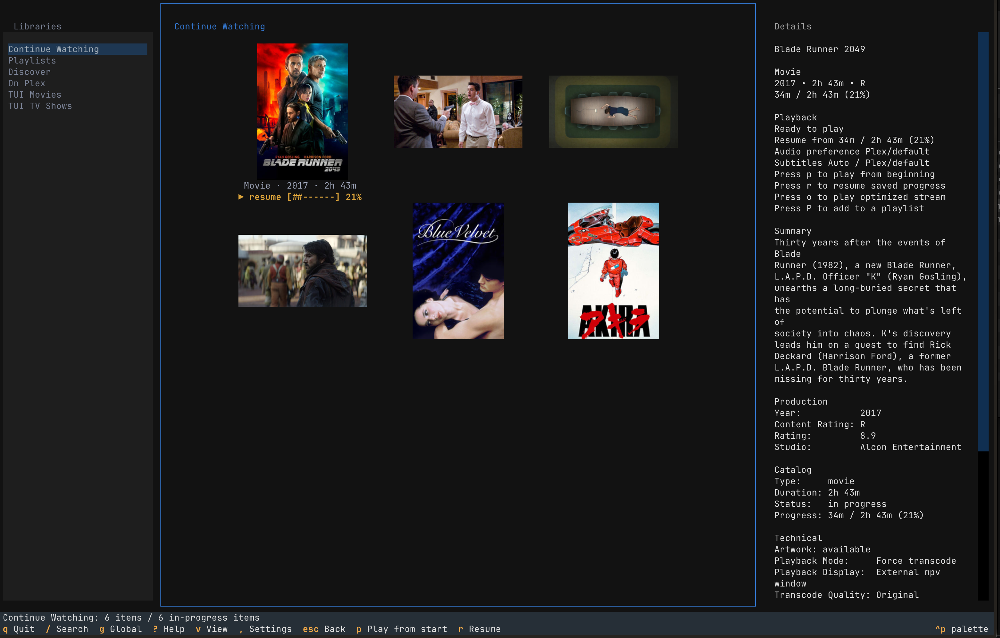
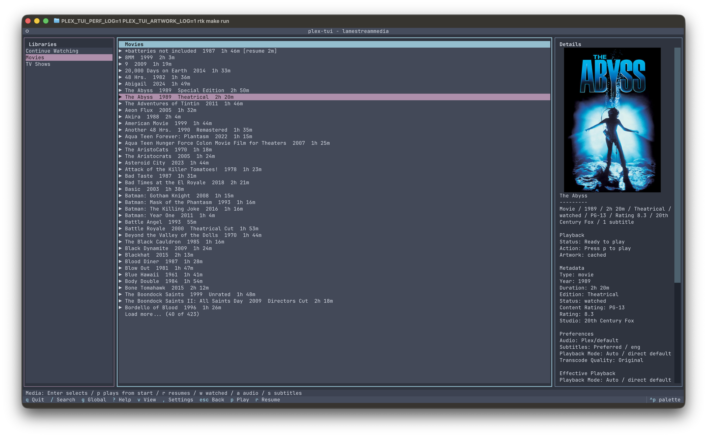
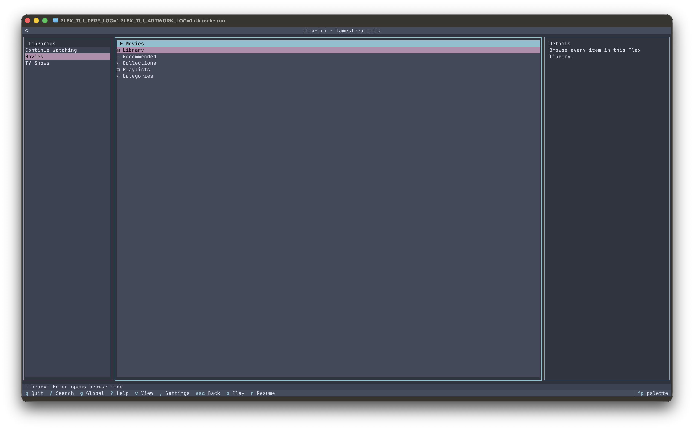
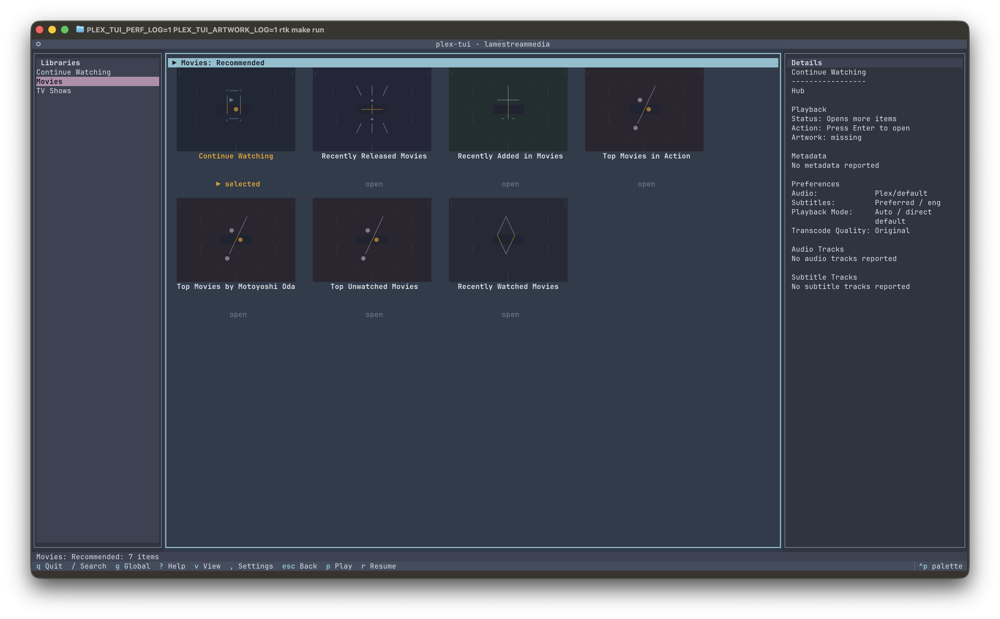
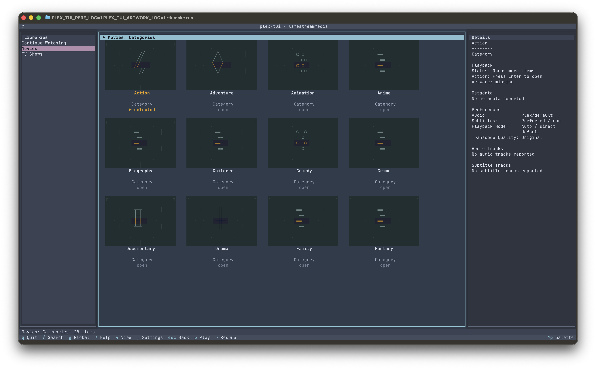
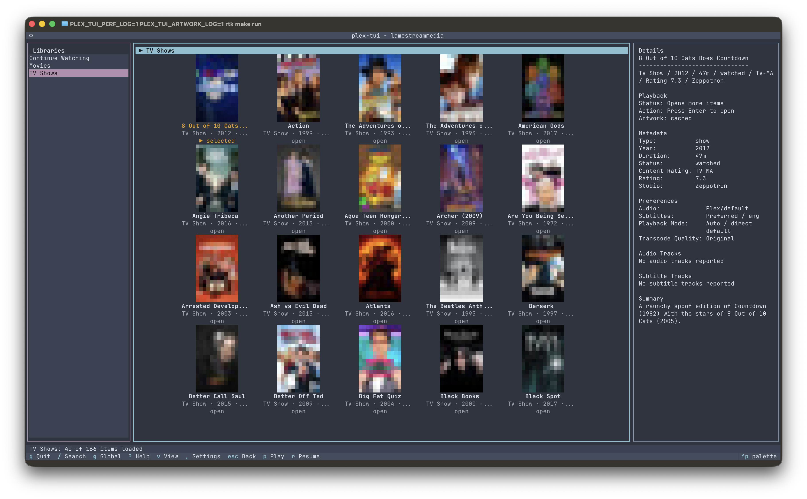

# plex-tui

[](https://github.com/so1omon563/plex-tui/actions/workflows/ci.yml)
[](https://github.com/so1omon563/plex-tui/releases/latest)
[](https://pypi.org/project/plex-tui/)
[](https://aur.archlinux.org/packages/plex-tui)
[](https://github.com/so1omon563/homebrew-plex-tui)
[](LICENSE)

A terminal Plex client built for watching media, not managing servers.

There are plenty of tools for administering Plex from the command line.
Surprisingly few are built for sitting down, browsing your library, and watching
something without leaving the terminal.

plex-tui is a standalone Textual application that brings Plex browsing, poster
artwork, collection cards, playlists, search, stream preferences, and `mpv`
playback into a keyboard-first terminal interface.

Built for people who spend their day in a terminal and would rather stay there.

## Why?

Most terminal Plex tools are built for administration, automation, or quick
status checks. Those are useful jobs, but they are not the same as browsing a
library, comparing options, and choosing something to watch.

Meanwhile, terminal applications got better. Tools like lazygit, gitui, btop,
and modern Textual apps raised the bar for what a TUI can be: rich layouts,
keyboard-first workflows, responsive interfaces, and even artwork are no longer
unusual.

plex-tui exists because browsing Plex and choosing something to watch deserves
that same kind of terminal-native experience.

## Project Status

plex-tui is still early, but already usable. Login, server selection, library
browsing, search, playlists, artwork, stream preferences, and playback are
working today. Expect rough edges, but expect progress too.

## Screenshots

### Movie grid



### Continue Watching



### List view



### Browse modes



### Collection cards





### Block renderer fallback



## Features

- Plex PIN login and server selection.
- Paged library browsing with automatic loading near the end of loaded items.
- Library submenu entrypoints for all items, Recommended, Collections,
  Playlists, and Categories. Library rows open all items by default; Space
  opens the browse-mode menu, and Settings can swap the primary and alternate
  actions.
- Current-library search and bounded global search.
- List view plus configurable-density grid view with terminal poster artwork,
  missing-artwork placeholders, and intentional glyph cards for collections and
  hubs.
- Intentional loading, empty, and Plex error states so slow or empty browse
  paths still show what happened and what to try next.
- External subtitle support and direct playback for embedded PGS/VOBSUB tracks.
- Audio and subtitle pickers with saved language preferences.
- Separate play-from-start and resume actions with Plex progress reporting.
- Watched/unwatched toggling for selected playable Plex items.
- Continue Watching episode rows show their show, season, and episode context,
  and items can be removed from the Continue Watching view.
- Playlist management for browsing all playlists, creating playlists from one
  or more selected items, adding/removing items, and renaming or deleting
  playlists.
- Movie editions appear as distinct variants when Plex reports multiple
  editions for a selected movie.
- Settings screen for stream preferences, playback mode and transcode quality,
  artwork modes, grid density, page size, auto-load threshold, grid artwork
  prefetching, media view, library visibility/order, library Enter behavior,
  and `mpv` window size.
- App diagnostics view for version, paths, `mpv`, Plex connection, artwork, and
  browsing settings.

## Requirements

- Python 3.11 or newer
- `mpv` available on `PATH`
- A Plex account/server

When installing with PyPI or from GitHub, install `mpv` with your platform
package manager:

```bash
# macOS
brew install mpv

# Debian / Ubuntu
sudo apt install mpv

# Fedora
sudo dnf install mpv

# Arch Linux / Manjaro
sudo pacman -S mpv
```

## Installation

### PyPI

```bash
pipx install plex-tui
plex-tui --smoke
plex-tui
```

This is the recommended cross-platform install path. It keeps Python
dependencies isolated, but you still need to install `mpv` separately. If
`pipx` is not installed, install it with your platform package manager first or
follow the pipx installation guide.

### Homebrew

```bash
brew trust --tap so1omon563/plex-tui
brew tap so1omon563/plex-tui
brew install plex-tui
plex-tui --smoke
```

The Homebrew formula installs `mpv` automatically. Apple Silicon macOS uses
prebuilt bottles when available, while Intel macOS still uses Homebrew's
source-build path. Homebrew 6 requires non-official taps to be trusted before
loading formulae from them; `plex-tui` only depends on formulae from
Homebrew/core, so no additional tap trust is required for dependencies.

### Arch Linux

```bash
paru -S plex-tui
plex-tui --smoke
```

The AUR package depends on `mpv`. Any AUR helper can be used; `paru` is only an
example.

### GitHub

```bash
pipx install "git+https://github.com/so1omon563/plex-tui.git"
pipx install "git+https://github.com/so1omon563/plex-tui.git@v0.4.4"
```

Use this path for testing `main` before a tagged/PyPI release.

Useful CLI checks:

```bash
plex-tui --version
plex-tui --config-path
plex-tui --debug-log-path
plex-tui --diagnostics
plex-tui --smoke
plex-tui status
plex-tui status --json
plex-tui libraries
plex-tui continue-watching --limit 5
plex-tui search "blade runner"
plex-tui search "alien" --library Movies --json
plex-tui discover "matrix" --limit 5
```

`status`, `libraries`, `continue-watching`, `search`, and `discover` are
read-only helpers for quick checks and scripts. Launch `plex-tui` with no
command for the full interactive browser and playback workflow.

For local development:

```bash
git clone https://github.com/so1omon563/plex-tui.git
cd plex-tui
python3 -m venv .venv
source .venv/bin/activate
make install-dev
make run
```

## First Run & Configuration

On first run, plex-tui starts a Plex browser login and asks which server
connection to save. If a browser cannot be opened, use the login URL shown in
the terminal.

The login flow writes a config file with the selected server URL and token. Use
the Settings screen or `plex-tui --config-path` to find the active file.

You can also configure a server manually. macOS config path:

```bash
mkdir -p "$HOME/Library/Application Support/plex-tui"
$EDITOR "$HOME/Library/Application Support/plex-tui/config.toml"
```

Linux config path:

```bash
mkdir -p "$HOME/.config/plex-tui"
$EDITOR "$HOME/.config/plex-tui/config.toml"
```

Minimal config:

```toml
base_url = "http://127.0.0.1:32400"
token = "your-plex-token"
```

Environment variables also work:

```bash
export PLEX_TUI_BASE_URL="http://127.0.0.1:32400"
export PLEX_TUI_TOKEN="your-plex-token"
```

See `config.example.toml` for optional settings.

## Playback

Playback is launched through `mpv`. By default, plex-tui opens an external mpv
window so the TUI can keep showing playback status and controls.

Common playback actions:

| Key | Action |
| --- | --- |
| `p` | Play the selected item from the beginning |
| `r` | Resume from the saved Plex position when available |
| `c` | Pause or resume the active `mpv` playback |
| `z` | Seek active playback back 10 seconds |
| `f` | Seek active playback forward 30 seconds |
| `x` | Stop the launched `mpv` process |
| `w` | Toggle watched / unwatched for the selected playable Plex item |

Playback behavior:

- Plex progress is updated in the background while playback is active.
- Pause and seek controls are sent to the active `mpv` process through its IPC
  socket after playback is launched.
- Experimental terminal playback can be enabled from Settings. It prefers
  mpv's Kitty/Ghostty graphics output when available, falls back to TCT text
  video elsewhere, uses Smooth/Balanced/Sharp terminal video profiles to trade
  frame size and frame rate for smoother rendering, suspends the TUI, and
  returns after mpv exits. This mode is a novelty/experiment and will be
  visibly worse than the normal external mpv window.
- Saved audio/subtitle language preferences are applied when matching streams
  are available.
- The details pane shows the effective playback choices for the selected item.
- Choosing an audio or subtitle track while playback is active also asks `mpv`
  to switch the active track when the launched stream exposes a matching track.

Playback mode and window sizing:

- Playback mode defaults to Plex direct/default behavior.
- Settings can force Plex transcoding with Original, 1080p 8 Mbps, 720p
  4 Mbps, or 480p 2 Mbps quality presets.
- The default `mpv` launch uses `--autofit=80%` so videos open at a comfortable
  size on modern displays.
- Settings can override the window size with values such as `90%`,
  `1280x720`, or `80%x80%`.
- If an older config has an exact `mpv_window_size = "1280x720"` override,
  cycle the mpv window-size setting once to return to the Default preset.

## Playlist Management

Playlist actions are available from selected playable media, the top-level
Playlists sidebar row, and from inside playlist views. Use `u` to build a bulk
selection, then use the same add/remove actions on the selected set.

| Key | Where | Action |
| --- | --- | --- |
| `enter` | Playlists sidebar row | Browse all Plex playlists |
| `enter` | Playlist row/card | Open that playlist |
| `u` | Media item | Toggle the item in the bulk selection |
| `P` | Playable media item or bulk selection | Open the Add to Playlist picker |
| `enter` | Add to Playlist picker | Add the selected media to an existing playlist |
| `enter` | `New playlist...` row | Prompt for a name and create a playlist containing the selected media |
| `backspace` / `delete` | Open playlist view | Remove the selected item or selected bulk items from that playlist |
| `e` | Playlist row/card or open playlist | Rename the playlist |
| `D` | Playlist row/card or open playlist | Confirm, then delete the playlist |

The Add to Playlist picker lists `New playlist...` first, followed by existing
Plex playlists. Playlist browsing is available from the top-level sidebar
`Playlists` row and from a library's browse modes.

## Key Bindings

| Key | Action |
| --- | --- |
| `q` | Quit |
| `ctrl+r` | Reload Plex connection |
| `/` | Fuzzy search loaded items in the current view |
| `g` | Search all libraries through Plex |
| `?` | Show help |
| `tab` / `shift+tab` | Move focus |
| `l` | Focus libraries |
| `m` | Focus media |
| `space` | Run the alternate action for a selected library |
| `v` | Toggle list/grid view |
| `pageup` / `pagedown` | Move one page in grid view |
| `,` | Show settings |
| `escape` | Clear search, go back, or close current view |
| `enter` | Open selected item |
| `p` | Play selected item from the beginning |
| `r` | Resume selected item from the saved Plex position |
| `w` | Mark selected item watched / unwatched |
| `P` | Add selected playable item to a playlist |
| `u` | Toggle selected item for bulk playlist actions |
| `backspace` / `delete` | Remove selected item from Continue Watching or a playlist |
| `e` / `D` | Rename / delete selected or open playlist |
| `a` / `s` | Choose audio / subtitle preference |
| `A` / `S` | Clear audio preference / cycle subtitle mode |
| `x` | Stop launched `mpv` |

## Artwork

plex-tui has two artwork paths: poster rendering for real media and glyph cards
for Plex objects that are not posters.

Poster rendering:

- Default mode renders portable colored block art, so it works in ordinary
  terminals without native image support.
- In Kitty and Ghostty, set `artwork_renderer` to `auto` to render native
  terminal images through Kitty Unicode placeholders.
- Set `artwork_renderer` to `kitty` to explicitly try the Kitty graphics
  protocol in other compatible terminals.
- Outside detected Kitty-compatible terminals, `auto` falls back to block art.
- `plex-tui --diagnostics` reports the active renderer status.

Collection-style cards:

- Collections, playlists, categories, hubs, and query shelves use geometric
  glyph artwork instead of pretending to be missing posters.
- Library browse-mode rows reuse that glyph vocabulary for compact wayfinding.
- Rows made entirely of those cards use roomier navigation-grid spacing.
- See `docs/collection-artwork-design.md` for the design notes behind that
  visual language.

Grid behavior and cache:

- Grid view fetches artwork for the visible page immediately.
- By default, it prepares three pages ahead in the background.
- `grid_prefetch_pages` can be set from `0` to `5`; use `0` to fetch only the
  visible page on slower systems.
- Compact, comfortable, and large density modes adjust card and poster sizing.
- The artwork cache is bounded and stored in the app cache directory shown in
  Settings.

## Diagnostics

Playback diagnostics are written to `debug.log` in the app config directory.
Tokens are redacted from logged `mpv` arguments.
The Settings diagnostics section can show the debug log path, recent log lines,
and an app diagnostics summary for support reports.

Useful paths:

```bash
plex-tui --config-path
plex-tui --debug-log-path
```

Enable browsing performance timings before launch:

```bash
PLEX_TUI_PERF_LOG=1 plex-tui
```

This also records alphabet-jump decisions, including the current title, Plex
sort title, loaded alphabet buckets, and selected target row.

To collect environment information for issue reports:

```bash
plex-tui --diagnostics
```

Verbose grid artwork internals are quieter by default. Include them only when
debugging poster loading:

```bash
PLEX_TUI_PERF_LOG=1 PLEX_TUI_ARTWORK_LOG=1 plex-tui
```

## Development

Common commands:

```bash
make smoke          # app construction and helper sanity check
make test           # pytest suite
make compile        # compile src and tests
make check-package  # build and validate package metadata
make check          # smoke, tests, compile, package validation
```

Packaging and release docs:

- `docs/app-design-philosophy.md`: whole-app UI direction and review checklist.
- `docs/collection-artwork-design.md`: geometric glyph card visual language.
- `PACKAGING.md`: PyPI/pipx, Homebrew, AUR, and standalone packaging options.
- `RELEASE.md`: release validation and tagging checklist.
- `ROADMAP.md`: planned follow-up work.
