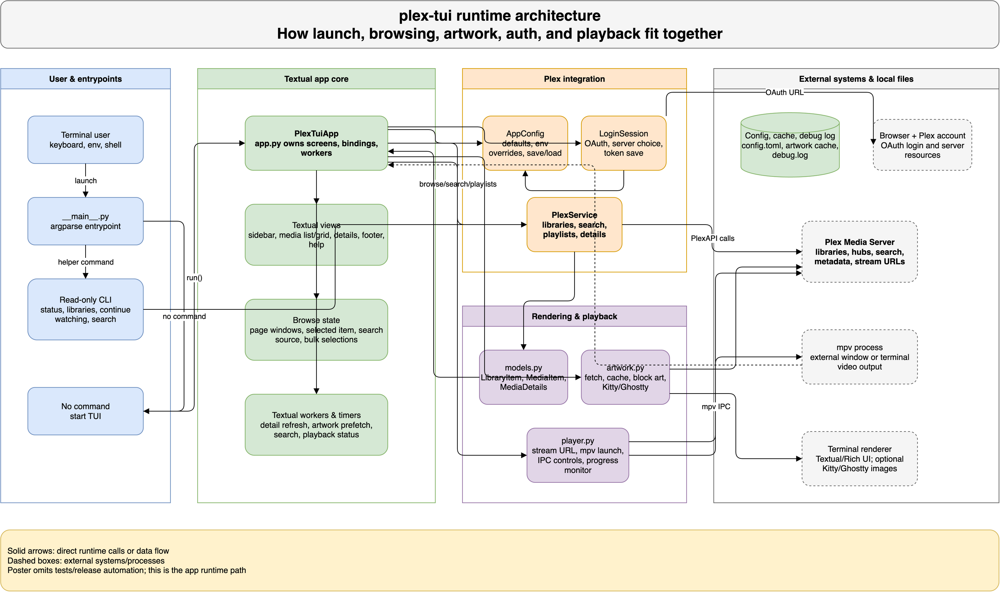
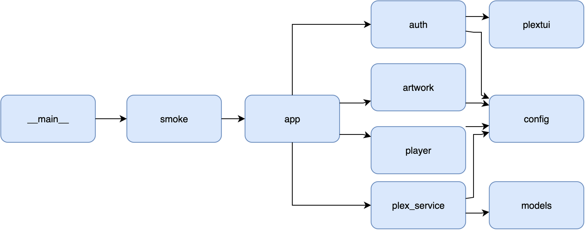

# Architecture

plex-tui is a Python/Textual app that maps Plex data into a keyboard-first
terminal interface and launches playback through `mpv`.

## Runtime Shape

1. `plex-tui` starts from `src/plextui/__main__.py`.
2. Config and auth load server/account state from `config.py` and `auth.py`.
3. `PlexTuiApp` in `app.py` owns Textual screens, focus, navigation, settings,
   and user actions.
4. `plex_service.py` translates PlexAPI objects into app-facing media models.
5. `artwork.py` prepares poster, block, and Kitty/Ghostty image render paths.
6. `player.py` builds token-redacted `mpv` launches and sends active playback
   controls through mpv IPC.

The app keeps Plex as the source of truth. It caches enough local state for
responsive browsing and artwork, but playback state, watched state, playlists,
and profile data flow back through Plex.

## Source Map

| Path | Responsibility |
| --- | --- |
| `src/plextui/app.py` | Textual app, panes, navigation, settings, and high-level actions |
| `src/plextui/plex_service.py` | Plex API mapping, browse/search/detail helpers |
| `src/plextui/player.py` | mpv launch, stream selection, IPC controls, diagnostics |
| `src/plextui/config.py` | Config files, environment overrides, settings validation |
| `src/plextui/auth.py` | Plex login, server selection, Plex Home profile tokens |
| `src/plextui/artwork.py` | Poster fetching, cache paths, block/native image rendering |
| `src/plextui/models.py` | Shared app data models |
| `tests/` | Focused unit and Textual navigation coverage |

## Design Boundaries

- The TUI is for choosing and watching media, not administering a Plex server.
- External `mpv` playback is the default watch path; terminal playback remains
  experimental.
- The details pane shows technical facts, but only after identity, playback,
  and summary context.
- Tokens and private paths must stay out of user-facing diagnostics and logs.

## Diagrams

